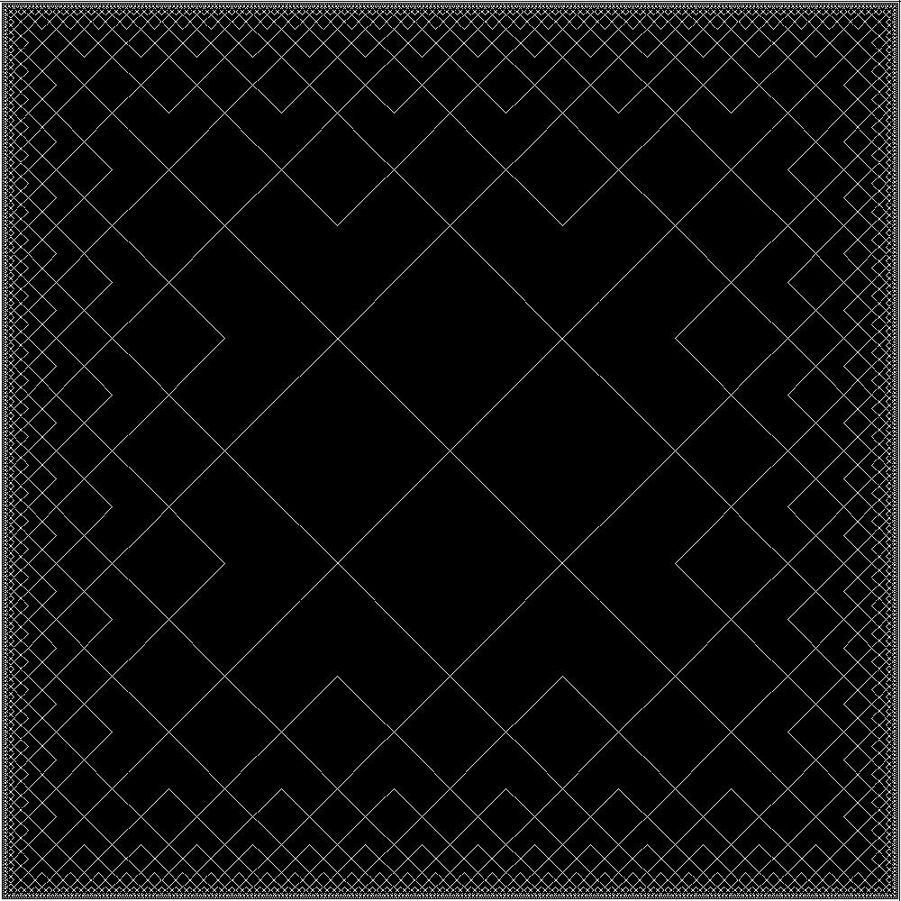

# Reading && Implementation
# Small Thing
## 00-Circuit_Simulator
source:
[Structure and Interpretation of Computer Programs](https://mitp-content-server.mit.edu/books/content/sectbyfn/books_pres_0/6515/sicp.zip/index.html)
## 01-Picture_Language
source:
[Structure and Interpretation of Computer Programs](https://mitp-content-server.mit.edu/books/content/sectbyfn/books_pres_0/6515/sicp.zip/index.html)

## 02-BlockCode
source:
[500 Lines or Less: Blockcode: A Visual Programming Toolkit](https://aosabook.org/en/500L/blockcode-a-visual-programming-toolkit.html)

## 03-L-System
source:
[The Algorithmic Beauty of Plants](https://www.semanticscholar.org/paper/The-Algorithmic-Beauty-of-Plants-Prusinkiewicz-Lindenmayer/bbbafedc32a441576322640b59b4fa42ef019430)

## 04-In-Memory_Graph_Database
source:
[500 Lines or Less: Dagoba: An In-Memory Graph Database](https://aosabook.org/en/500L/dagoba-an-in-memory-graph-database.html)

## 05-What's_Binding_in_OpenGL
  Understanding the Binding Mechanism in OpenGL

## 06-What's_Coroutine
  Understanding Coruntine by Building it with ucontext.h